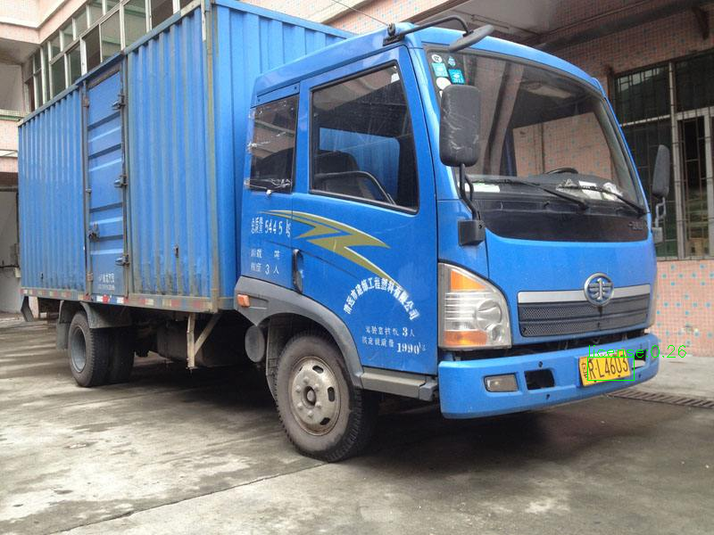
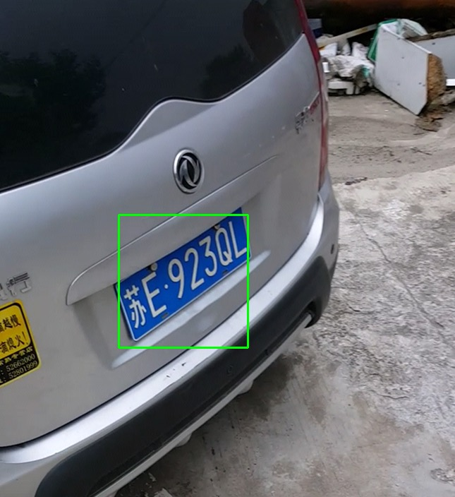
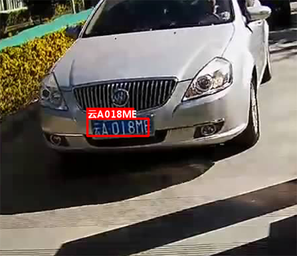

## Mobilenet-SSD License Plate Detection & Recognition
This is a project for license plate detection using mobilenet-ssd.

### Last Update !! : 2019.07.22

Add mssd512_voc.caffemodel with high accuracy and low complexity

- Accuracy : 94.6%.
- Speed : 30ms(multi-cores) on 720P images.(OpenCV 4.0)

## Install
- Caffe-SSD or Opencv 4.0

##### Note: 使用OpneCV 4.0 中的DNN模块 无需安装Caffe.

## Results

###  Recognition Demo

简单的结合HyperLPR中的端到端模型，可以简单的实现车牌识别:

